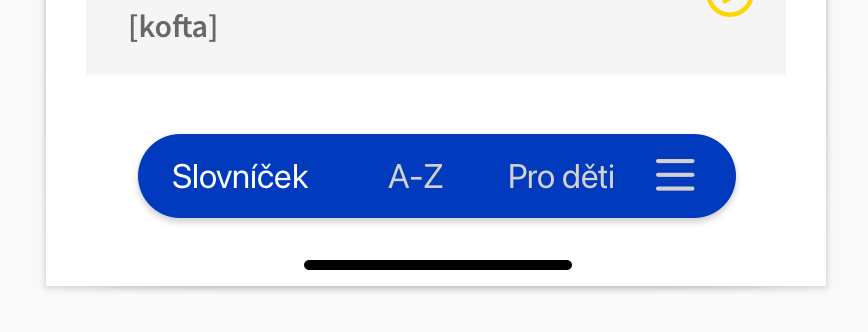

# Přidej se k vývoji MOVAPP na Apple zařízení

- [Správa slovíček](translations/README.md) 

## TabBar

- Aktuálně používáme [fork](https://github.com/pionl/TabBar/tree/master)
- Máme bug s scrollview který nepočítá s tabbarem - lze upravit tímto https://www.fivestars.blog/articles/safe-area-insets-2/

