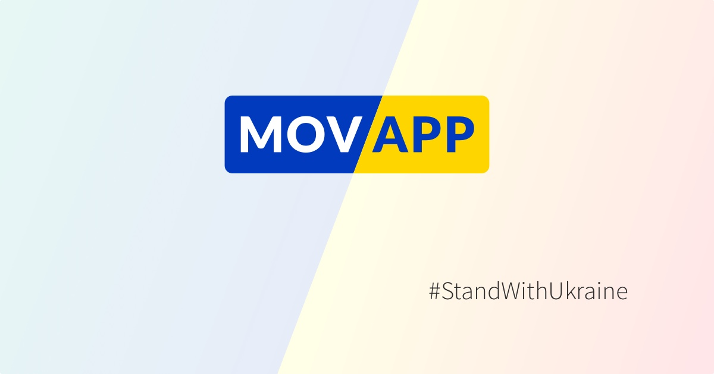

[](https://github.com/cesko-digital/movapp-apple/actions/workflows/build.yml)
[](https://github.com/cesko-digital/movapp-apple/actions/workflows/precheck.yml)

The aim of [Movapp.cz](Movapp.cz) is to facilitate communication between Czechs and Ukrainians. "Mова" [mova] means "language" in Ukrainian. Movapp is a language training application.

The project was initiated in the community of expert volunteers at [Česko.Digital](https://cesko.digital). Contact: [pryvit@movapp.cz](mailto:pryvit@movapp.cz).

The source code is under the MIT license. Texts, images, and audio files are licensed under CC BY-NC 4.0. More details can be found in the [LICENSE](LICENSE)

If you wish to help us with further development of the project, please fill out the form at [cesko.digital/join](https://cesko.digital/join) and join our Slack channel `#ua-movaapp`. 

# Used Technologies

- SwiftUI + Swift Packages
- iOS 15+
- iPad (15+)
- Widget (15+)
- Mac Catalyst (TODO)
- Apple Watch (9+)

# Contributing

At first if you want to add new features or have ideas, join us on Slack.

Basic usage is simple:

```bash
git clone git@github.com:cesko-digital/movapp-apple.git movapp-apple
cd movapp-apple
```

Further information can be found in the [CONTRIBUTING](CONTRIBUTING.md) file.

## Usefull links

- [Scope of Work](https://docs.google.com/document/d/1r7OdwaUiGZKd2qcHHMGeqtTYHlOB6zOzfW9K1sxuY6s/edit?usp=sharing)
- [Temporary Graphics](https://www.sketch.com/s/5d264dba-950d-4169-8a59-9c048c9183a5/a/3OwLoqG/play)
- [Current Set of Screenshots](https://cesko-digital.github.io/movapp-apple/screenshots.html)
- [Trello](https://trello.com/b/XumGa4K8/movapp-backlog)

